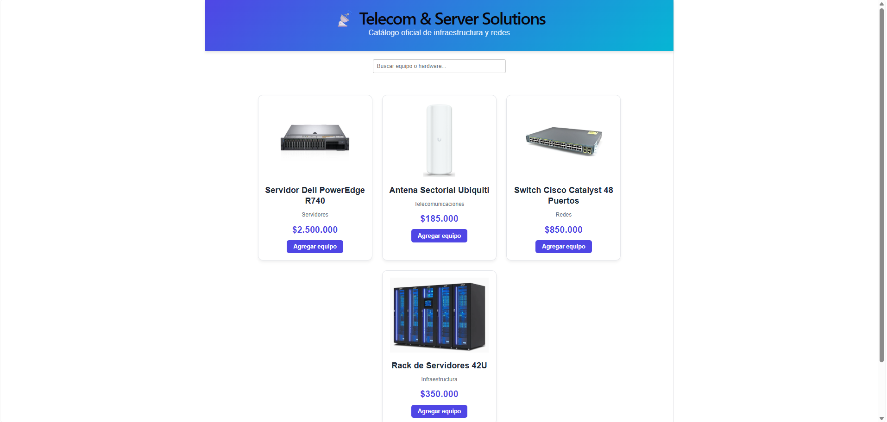
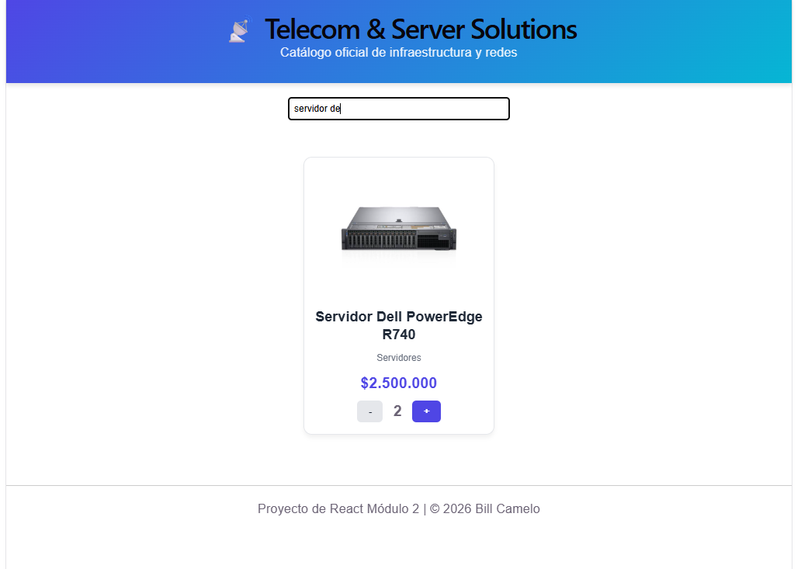

# E-commerce Estantería - Telecom & Servers

## Descripción
Esta es mi entrega para la evaluación del Módulo 2 de React. Es un catálogo de equipos de telecomunicaciones donde simulo el listado de productos consumiendo un archivo JSON local. 

## Componentes creados
Separé la interfaz en 6 componentes (ubicados en `/src/components`):
- **Header:** Logo y título de la tienda.
- **SearchBar:** El input controlado para buscar equipos.
- **ProductList:** Renderiza la lista filtrada usando `.map`.
- **ProductCard:** Recibe las props (nombre, precio, imagen) y usa `useState` para manejar el contador de productos.
- **Button:** Botón reutilizable.
- **Footer:** Información básica del proyecto.

## Tecnologías usadas
- React + Vite
- CSS estándar
- JSON (para los datos falsos de los productos)

## Ejecutar el proyecto localmente
1. Clonar el repositorio.
2. Instalar dependencias con: `npm install`
3. Levantar el servidor con: `npm run dev`

## Capturas de pantalla

